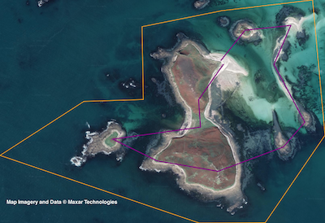

# Drone Flight Validation



This is prototype code towards validating drone flight plans. It checks a planned flight path is wholly within a defined boundary.

Requires NodeJS and the Canvas package to be installed.


## Description of files

### flight-boundary-example.json
A standard GEO-JSON formatted file with latitude and longitude coordinates for each vertex of the required flight boundary polygon. The first coordinate and last coordinate must be the same to close the polygon. The polygon can be of any shape (although complex polygons with crossing sides are not allowed).

### drone-mission-example.json
A JSON file formatted in an example standard way, holding details of a planned drone flight path, with latitude and longitude coordinates of take-off, landing and intermediate waypoints in between. 

### flightValidation.js
This Javascript code holds the logic to test if the planned drone flight path is wholly within the given flight boundary. Returns and logs to Node console *true* if it is, or *false* if any part of the flight path goes outside the boundary.
For convenience in generating the *basemap.png* (see below), it also logs to console the coordinates of the corners of a rectangle representing the map extent covered by all coordinates within the input json files.

``` $ node flightvalidation.js ```

### drawFlightPlan.js
This Javascript code allows the boundary and the flight path to be visualised to scale on a map, and to be saved to file as *flight.png*.

``` $ node drawFlightPlan.js ```

### basemap.png
Because the project is just a prototype and would be intended to fit within a larger application that could render mapping appropriately, the basemap is simply simulated manually here for visualisation purposes. The min and max lat, long coordinates logged by *flightValidation.js* can be used to select the correct map content to be used as an input file for *drawFlightPlan.js*.

### readFlightData.js
This is a module required by both *drawFlightPlan.js* and *flightValidation.js* and is not executed separately.

### flight.png
An output picture file showing path of the drone flight plan in purple, and the flight boundary in orange. *basemap.png* sets the background map.